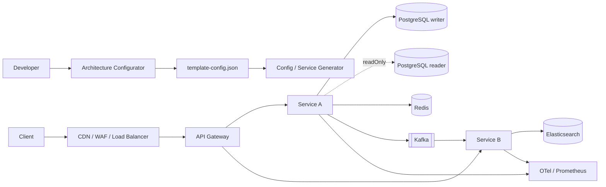

# MyProjectTemplate

> 필요한 플랫폼 기능만 선택해 조립하고, 처리량과 가용성은 실측으로 증명하는 Spring 기반 MSA 모노레포 템플릿

[](https://github.com/chanho4702/MyProjectTemplate/actions/workflows/ci.yml)


`MyProjectTemplate`은 여러 기술을 한꺼번에 켜 놓은 예제 프로젝트가 아니다. PostgreSQL R/W 분리, Redis, Kafka, Elasticsearch, OIDC, 관측성을 독립 모듈로 제공하고 프로젝트마다 필요한 것만 선택하게 만든 플랫폼 starter kit이다.

현재 v0.1은 **백엔드 플랫폼 기반, 구성 마법사, 로컬 인프라와 검증 하네스**를 제공한다. 실제 서비스용 React 프론트엔드는 다음 단계이며, 아직 구현된 기능처럼 표시하지 않는다.

## 왜 만들었나

| 반복되는 문제 | 이 템플릿의 해법 |
|---|---|
| 서비스마다 요청 ID, 오류 형식, 보안 설정을 다시 작성한다 | 공통 Spring Boot starter로 경계를 통일한다 |
| Redis·Kafka·검색을 일단 넣고 보면서 결합도가 커진다 | 기능 포트와 명시적 활성화 스위치로 필요한 모듈만 켠다 |
| 읽기 복제본을 추가해도 코드 곳곳에 DataSource 분기가 생긴다 | `@Transactional(readOnly = true)`만 reader로 자동 라우팅한다 |
| local 설정이 dev·prod에 섞여 운영 사고로 이어진다 | profile과 환경변수 계약을 local/dev/prod로 분리한다 |
| 근거 없이 “몇 TPS까지 가능”하다고 말한다 | 동일한 k6 시나리오와 SLO·포화 지표로 환경별 기준선을 측정한다 |
| MSA를 시작하자마자 Git 저장소까지 잘게 나눈다 | 하나의 Git 모노레포에서 서비스별 빌드·이미지·배포 경계를 유지한다 |

## 현재 제공하는 것

- Spring Boot 3.5.16 / Java 21 / Spring Cloud 2025.0.3 기준선
- API Gateway와 circuit breaker, 안전한 요청 ID 전파
- 표준 Problem Detail 오류 응답과 Bean Validation
- PostgreSQL writer/reader 라우팅, Flyway, reader 미설정 fallback
- 타입 안전 JSON cache와 TTL을 제공하는 Redis adapter
- 공통 event envelope와 idempotent producer를 제공하는 Kafka adapter
- 비즈니스 코드가 Elasticsearch SDK에 직접 묶이지 않는 `SearchGateway`
- 선택형 OIDC resource server와 local permit-all 모드
- Prometheus, Micrometer Tracing, OTLP 관측성 기반
- Compose profile 기반 PostgreSQL replica, Redis, Kafka, Elasticsearch, Keycloak
- 목표 TPS·동시성·가용성·기능을 선택하는 웹 구성 마법사
- 서비스 생성기, 공통 Dockerfile, GitHub Actions CI, k6 시나리오

## 아키텍처 한눈에 보기



서비스는 다른 서비스의 DB를 직접 읽지 않는다. 동기 통합은 Gateway/API 계약으로, 비동기 통합은 이벤트 계약으로 연결한다. Redis는 캐시이고 Kafka는 이벤트 전달 계층이므로 하나의 모호한 인터페이스로 합치지 않는다.

## 5분 빠른 시작

### 요구 사항

- JDK 21
- Docker Engine과 Docker Compose v2
- Node.js 22 이상: 구성 마법사를 실행할 때만 필요
- PowerShell 7 또는 Bash

### 1. 저장소와 PostgreSQL 실행

```powershell
git clone https://github.com/chanho4702/MyProjectTemplate.git
cd MyProjectTemplate

# 시스템 JAVA_HOME이 다른 버전일 때만 지정
$env:JAVA_HOME='C:\Program Files\Java\jdk-21'

docker compose --env-file infra/.env.versions -f infra/compose.yml up -d postgres
```

### 2. 샘플 서비스 실행

```powershell
./gradlew :services:sample-service:bootRun --args='--spring.profiles.active=local'
```

```bash
curl http://localhost:8081/actuator/health
curl http://localhost:8081/api/v1/items
```

### 3. Gateway 경유 확인

다른 터미널에서 Gateway를 실행한다.

```powershell
./gradlew :services:gateway-service:bootRun
curl http://localhost:8080/api/v1/items
```

## 옵션 구성 마법사

처음부터 모든 인프라를 실행할 필요가 없다. 구성 화면에서 목표 TPS, 동시성, 가용성, 배포 대상과 기능을 선택하면 다음 결과를 얻는다.

- 권장 topology와 주의사항
- 필요한 Compose profile 실행 명령
- 애플리케이션 feature 환경변수
- 저장 가능한 `template-config.json`

```powershell
cd tools/configurator
npm ci
npm run dev
```

다운로드한 설정 파일을 저장소 루트에 두고 적용한다.

```powershell
./tools/apply-config.ps1
```

기본 설정 예시는 다음처럼 기능을 독립적으로 선택한다.

```json
{
  "capacity": {
    "targetTps": 300,
    "availabilityTarget": "99.9",
    "peakConcurrency": 500
  },
  "features": {
    "database": "postgresql",
    "readWriteSplit": true,
    "redis": true,
    "kafka": true,
    "elasticsearch": false,
    "oidc": true,
    "observability": true
  }
}
```

이 숫자는 보장 성능이 아니라 부하 시험 입력값이다.

## PostgreSQL R/W 분리

비즈니스 코드는 DataSource 이름이나 replica 주소를 알 필요가 없다.

```java
@Transactional
public Item create(...) {
    // writer 사용
}

@Transactional(readOnly = true)
public List<Item> findAll() {
    // reader URL이 있으면 reader, 없으면 writer 사용
}
```

안전 규칙:

- 쓰기와 기본 트랜잭션은 항상 writer로 간다.
- 명시적인 `readOnly = true`만 reader를 사용한다.
- reader URL이 없으면 자동으로 writer에 fallback한다.
- 쓰기 직후 강한 일관성이 필요한 조회는 writer 트랜잭션 안에서 처리한다.
- 애플리케이션은 replica 목록이 아니라 관리형 reader endpoint 또는 DB proxy를 바라본다.

자세한 구현은 [`platform-starter-data-jpa`](starters/platform-starter-data-jpa/src/main/java/dev/platform/starter/data/PlatformDataSourceAutoConfiguration.java)에서 확인할 수 있다.

## 모듈 선택표

starter를 의존성에 추가하고 기능 스위치를 켰을 때만 외부 인프라 adapter가 활성화된다.

| 모듈 | 활성화 조건 | 제공 기능 |
|---|---|---|
| `platform-starter-web` | 기본 | 요청 ID, UTC Clock, Problem Detail |
| `platform-starter-data-jpa` | `platform.datasource.enabled=true` | JPA, Flyway, writer/reader routing |
| `platform-starter-redis` | `platform.redis.enabled=true` | JSON cache, TTL, 안전한 key 구성 |
| `platform-starter-kafka` | `platform.kafka.enabled=true` | event envelope, publisher, idempotent producer |
| `platform-starter-search` | `platform.search.enabled=true` | 검색 포트와 Elasticsearch adapter |
| `platform-starter-security` | `platform.security.enabled=true` | JWT/OIDC resource server |
| `platform-starter-observability` | 의존성 기반 | Prometheus, tracing, OTLP |

모든 기능을 강제로 포함하는 `starter-all`은 제공하지 않는다.

## 로컬 인프라 조립

```bash
# PostgreSQL writer + streaming reader
docker compose --env-file infra/.env.versions -f infra/compose.yml \
  --profile database-ha up -d

# Redis와 Kafka 추가
docker compose --env-file infra/.env.versions -f infra/compose.yml \
  --profile cache --profile messaging up -d

# 검색과 로컬 OIDC까지 추가
docker compose --env-file infra/.env.versions -f infra/compose.yml \
  --profile search --profile identity up -d
```

| Profile | 구성 요소 | 로컬 용도 |
|---|---|---|
| 기본 | PostgreSQL writer | 모든 서비스의 기본 저장소 |
| `database-ha` | PostgreSQL streaming reader | read-only 라우팅과 복제 지연 검증 |
| `cache` | Redis | cache와 TTL 검증 |
| `messaging` | Kafka KRaft | 이벤트 발행·소비 검증 |
| `search` | Elasticsearch | 색인·검색 검증 |
| `identity` | Keycloak | OIDC/JWT 검증 |

Compose는 로컬 개발용이다. 운영에서 이 구성을 그대로 사용하지 않는다.

## 환경 분리

| 구분 | local | dev | prod |
|---|---|---|---|
| 목적 | 개인 개발 | 팀 통합·QA | 사용자 트래픽 |
| 인프라 | Docker Compose | 공유 또는 관리형 개발 인프라 | 관리형 다중 AZ 권장 |
| Secret | 로컬 `.env` | dev Secret Manager | 별도 prod 계정과 Secret Manager |
| 이미지 | 로컬 빌드 허용 | commit SHA | 승인된 불변 digest |
| DB migration | 앱 시작 시 허용 | 배포 단계 권장 | 독립 migration job과 승인 |
| 보안 | localhost 편의값 | 인증 필수 | TLS·인증·최소 권한 필수 |

`prod`는 `local` profile을 포함하지 않는다. 운영 URL과 자격증명은 이미지가 아니라 런타임 환경에서 주입한다.

## 처리량과 가용성

`C0~C3`은 보장 등급이 아니라 최초 배치와 시험 범위를 정하기 위한 계획 등급이다.

| 등급 | 시작 배치 | 승격에 필요한 검증 |
|---|---|---|
| C0 개발 | 서비스당 1개 | 기능 smoke |
| C1 소형 | 서비스당 2개 | 목표 TPS 2배를 30분 유지 |
| C2 중형 | 서비스당 3개 이상 + reader | 인스턴스 하나 제거 후 목표 TPS 유지 |
| C3 고부하 | 서비스별 autoscaling + 다중 AZ | spike, soak, failover와 포화 지표 검증 |

```bash
k6 run -e BASE_URL=http://localhost:8081 load-tests/smoke.js
k6 run -e BASE_URL=http://localhost:8081 -e TARGET_TPS=100 load-tests/capacity.js
```

TPS만 기록하지 않는다. Git SHA, 인스턴스 사양, 데이터 크기, p95/p99, 오류율, DB pool, Kafka lag와 장애 복구 시간을 함께 남긴다.

## 실제 확인한 범위

2026-08-15 로컬 환경에서 다음을 확인했다.

| 검증 | 결과 |
|---|---|
| 전체 Gradle 프로젝트 테스트 | 통과 |
| 구성 마법사 프로덕션 빌드와 서버 렌더 테스트 | 통과 |
| 구성기 `npm audit` | 취약점 0건 |
| 모든 Compose profile 구성 해석 | 통과 |
| PostgreSQL writer→reader 복제 | 통과 |
| writer 중단 중 기존 데이터 read-only 조회 | 통과 |
| Gateway→sample-service 실제 프록시 호출 | HTTP 200 |
| 요청 ID 전달과 응답 헤더 단일화 | 통과 |

Redis failover, Kafka broker 장애·재처리, Elasticsearch 대량 색인, Kubernetes 다중 AZ는 아직 검증하지 않았다. 전체 근거와 비보장 범위는 [검증 기록](docs/verification.md)에 있다.

## 저장소 구조

```text
MyProjectTemplate/
├─ services/                 # 독립 실행·배포되는 Gateway와 백엔드 서비스
├─ starters/                 # 재사용 가능한 Spring Boot platform starter
├─ infra/                    # profile 기반 로컬 인프라
├─ tools/configurator/       # 아키텍처 옵션 UI
├─ tools/                    # 설정 적용·서비스 생성기
├─ templates/                # 신규 서비스 골격
├─ load-tests/               # k6 smoke와 capacity 시나리오
├─ config/                   # template-config JSON schema
├─ docs/                     # 버전이 고정되는 기술 문서
└─ .github/                  # CI, Dependabot, PR 문서 동기화 체크
```

하나의 Git 저장소를 사용하지만 서비스별 빌드, Docker 이미지, 데이터 소유권과 배포 경계는 독립적으로 유지한다. 프론트엔드가 추가되면 `apps/web`과 `packages/`를 같은 모노레포에 포함한다.

## 새 서비스 만들기

```powershell
./tools/new-service.ps1 -Name order-service -BasePackage com.acme.order
./gradlew :services:order-service:test
```

생성기는 `template-config.json`을 읽어 선택된 starter만 `build.gradle`에 추가하고, 루트 Gradle 설정은 새 서비스를 자동 발견한다.

## 로드맵

- [x] 조립 가능한 backend starter와 Gateway
- [x] PostgreSQL writer/reader와 로컬 인프라
- [x] 옵션 구성 마법사와 서비스 생성기
- [x] 기본 k6/CI 검증 기반
- [ ] React 19 + Vite + TypeScript 서비스 프론트
- [ ] OIDC 로그인, Gateway/BFF, OpenAPI client 생성
- [ ] spike·soak·자동 failover와 Prometheus 결과 리포트
- [ ] Helm, HPA, PDB, NetworkPolicy, migration/rollback runbook
- [ ] outbox/CDC, OpenSearch/Valkey, object storage adapter

진행 조건과 완료 기준은 [전체 로드맵](docs/roadmap.md)에 있다.

## 문서

- [문서 허브와 GitHub–Notion–Obsidian 동기화 규칙](docs/README.md)
- [빠른 시작](docs/quickstart.md)
- [권장 아키텍처](docs/architecture.md)
- [local/dev/prod 환경 전략](docs/environments.md)
- [모듈 카탈로그](docs/module-catalog.md)
- [처리량과 가용성 검증](docs/capacity-testing.md)
- [검증 기록](docs/verification.md)
- [전체 로드맵](docs/roadmap.md)

## 설계 원칙과 비보장

- 공통 starter에 비즈니스 도메인 타입을 넣지 않는다.
- 서비스가 다른 서비스의 DB를 직접 참조하지 않는다.
- 사용하지 않는 인프라 모듈은 의존성과 실행 profile에서 제거한다.
- 특정 TPS, 가용성, 무손실 이벤트 처리를 근거 없이 보장하지 않는다.
- 로컬 Compose의 비밀번호와 보안 비활성화 값을 운영에 복사하지 않는다.
- Kubernetes와 실제 서비스용 프론트엔드는 아직 제공 범위가 아니다.

변경 전에는 루트 [`AGENTS.md`](AGENTS.md)의 경계 규칙을 확인하고, PR에서 코드·테스트·문서를 함께 갱신한다.
