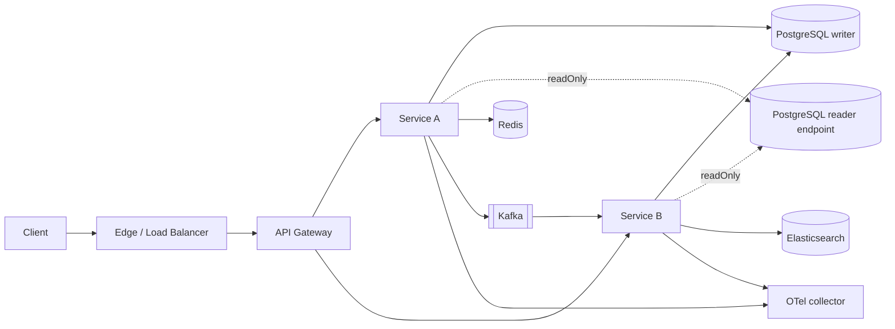
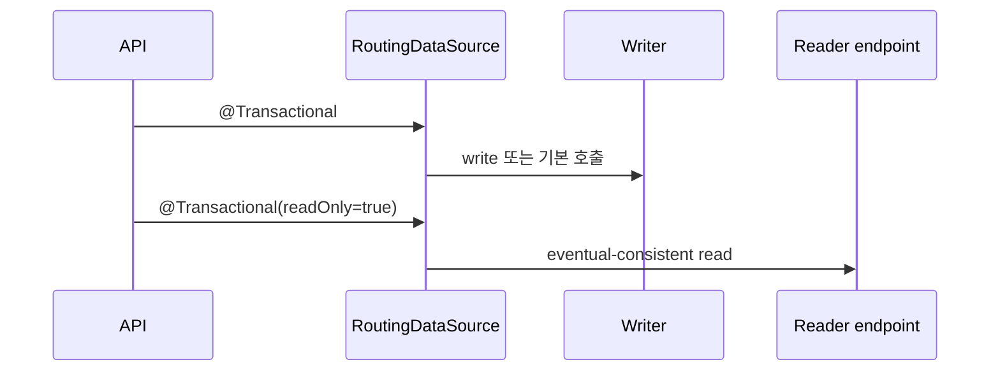

# 권장 아키텍처

## 1. 논리 구조

서비스는 다른 서비스의 DB를 읽지 않는다. 동기 호출은 명확한 API 계약으로, 비동기 통합은 Kafka 이벤트로 연결한다. Redis는 캐시와 짧은 수명의 조정 데이터에 사용하며 영속 이벤트 원장으로 간주하지 않는다.

## 2. 용량 등급은 실측으로 승격한다

아래 값은 보장 TPS가 아니라 최초 부하 시험을 위한 배치 시작점이다.

| 계획 등급 | 초기 애플리케이션 배치 | 데이터 계층 | 필수 검증 |
|---|---|---|---|
| C0 개발 | 서비스당 1개, 0.5~1 vCPU | 단일 PostgreSQL | 기능 스모크 |
| C1 소형 | 서비스당 2개, 각 1~2 vCPU | writer 1 + 백업 | 목표 TPS 2배 30분 |
| C2 중형 | 서비스당 3개 이상, 각 2~4 vCPU | writer + reader endpoint | 장애 1개 제거 후 목표 TPS 유지 |
| C3 고부하 | 서비스별 독립 autoscaling | 다중 AZ 관리형 DB, 파티션 설계 | 단계 상승·spike·soak·failover |

최종 등급은 다음 조건을 모두 만족한 결과에만 붙인다.

- 목표 TPS에서 p95와 p99가 서비스 SLO 이내다.
- 5xx와 timeout 비율이 error budget 이내다.
- CPU, 메모리, GC, DB pool, Kafka lag 중 하나도 지속 포화되지 않는다.
- 인스턴스 하나를 제거해도 허용된 복구 시간 안에 정상화된다.
- 테스트 데이터 크기가 운영 예상량을 반영한다.

## 3. PostgreSQL 읽기/쓰기 분리

starter는 안전한 기본값을 위해 다음 규칙을 사용한다.

- 명시되지 않은 트랜잭션은 writer로 간다.
- `readOnly=true`인 트랜잭션만 reader로 간다.
- reader URL이 없으면 모든 요청을 writer로 보낸다.
- 쓰기 직후 최신 값을 읽어야 하는 흐름은 같은 writer 트랜잭션에서 처리한다.
- 애플리케이션이 여러 replica를 직접 순회하지 않고 관리형 reader endpoint 또는 DB proxy에 위임한다.

복제 지연을 허용할 수 없는 잔액, 재고 확정, 권한 변경 직후 조회에는 reader를 사용하지 않는다.

## 4. 기능별 경계

| 기능 | 애플리케이션 포트 | 기본 구현 | 대체 가능 구현 |
|---|---|---|---|
| 캐시 | `JsonCache` | Redis | Caffeine, managed Redis |
| 이벤트 발행 | `EventPublisher` | Kafka | outbox relay, cloud broker adapter |
| 검색 | `SearchGateway` | Elasticsearch | OpenSearch adapter |
| 인증 | 표준 JWT/OIDC | 외부 IdP, 로컬 Keycloak | Auth0, Entra ID, Cognito |
| 관측 | Micrometer/OTLP | OTel collector | 상용 APM exporter |

제품이 다른 기술을 쓰더라도 비즈니스 코드의 포트는 유지하고 adapter만 교체한다. 단, Kafka와 Redis Streams처럼 전달 보장이 다른 시스템을 같은 구현으로 취급하지 않는다.
