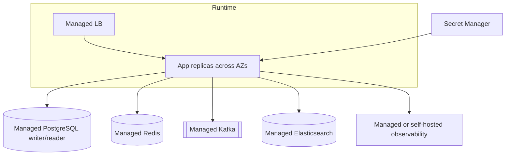

# 환경 전략

## 환경별 책임

| 항목 | local | dev | prod |
|---|---|---|---|
| 목적 | 개인 개발 | 팀 통합·QA | 사용자 트래픽 |
| 인프라 | Docker Compose | 공유 클러스터 또는 관리형 개발 인스턴스 | 관리형 다중 AZ 권장 |
| 데이터 | 삭제 가능한 시드 | 마스킹된 테스트 데이터 | 실제 데이터 |
| Secret | 로컬 `.env` | Secret Manager의 dev 경로 | 별도 prod 계정과 Secret Manager |
| 이미지 | 로컬 빌드 허용 | commit SHA | 승인된 불변 digest |
| DB 변경 | 앱 시작 시 Flyway 허용 | 배포 단계에서 실행 권장 | 별도 migration job과 승인 |
| Elasticsearch 보안 | localhost에서만 비활성 허용 | 인증 필수 | TLS·인증·백업 필수 |
| 관측 보존 | 짧음 | 7~30일 | 규정과 비용에 맞게 결정 |

## Spring profile

- `application.yml`: 모든 환경의 공통 계약과 안전한 기본값
- `application-local.yml`: localhost 포트와 개발 편의 기능
- `application-dev.yml`: 공유 개발계 주소를 환경변수로 받는다.
- `application-prod.yml`: URL, 자격증명, replica endpoint가 없으면 기동 실패하도록 둔다.

`prod`가 `local`을 include하지 않는다. 운영 값은 이미지에 굽지 않고 런타임 환경과 Secret Manager에서 주입한다.

## 운영 배포 권고

Compose는 운영 배포 파일이 아니다. Kubernetes를 선택하면 후속 단계에서 Helm chart와 PodDisruptionBudget, HPA, NetworkPolicy를 생성한다. VM을 선택하면 systemd 또는 컨테이너 오케스트레이션, L7 load balancer, 배포 단위 격리를 별도로 구성한다.

## 운영 안전 장치

- actuator는 health와 metrics만 필요한 네트워크에 공개한다.
- JPA `ddl-auto`는 `validate`다.
- DB pool 크기는 인스턴스 수를 곱한 총합으로 계산한다.
- Kafka topic 자동 생성은 운영에서 끈다.
- Elasticsearch index template과 alias 변경은 배포 코드로 관리한다.
- Redis `KEYS`와 무제한 TTL 데이터 생성을 금지한다.
