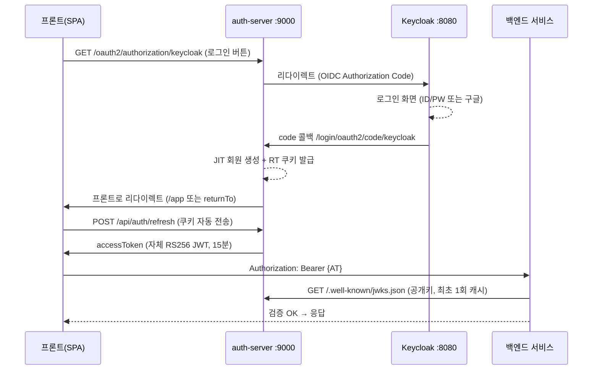

# 인증서버 재사용 가이드 — 다른 프로젝트에 이식하기

> **한 줄 결론: 된다.** auth-server는 처음부터 **별도 repo(`github.com/chanho4702/auth-server`)** 로 만들어진 독립 서비스라, "인증서버 + Keycloak + Postgres" 세트만 통째로 들고 가면 어떤 프로젝트에서든 로그인 플랫폼으로 쓸 수 있다. 프론트/백엔드는 각각 **딱 4개 API 호출**과 **JWKS URL 하나**만 알면 붙는다.

관련 문서: [[인증 8단계 — Keycloak BFF 자체-JWT 플랫폼 (구현 기록)]], [[인증 8단계 — keycloakify MUI 로그인 테마 (구현 기록)]], [[인증 8단계 — 로그아웃 백채널 수정 (구현 기록)]], [[인증 6-7단계 OAuth2-OIDC 로그인]]

---

## 0. 큰 그림 — 이 인증서버는 뭐 하는 물건인가

이 시스템은 흔히 말하는 **BFF(Backend For Frontend) 인증 패턴**이다. 역할 분담이 명확하다:

| 구성요소 | 역할 | 비유 |
|---|---|---|
| **Keycloak** (:8080) | "비밀번호를 아는 유일한 곳". 로그인 화면, 구글 소셜로그인, 회원가입, 비밀번호 검증 전부 담당 | 건물 정문의 신분 확인 데스크 |
| **auth-server** (:9000) | Keycloak이 "이 사람 맞아"라고 하면, **우리 플랫폼 전용 출입증(자체 JWT)** 을 발급 | 방문증 발급기 |
| **각 백엔드 서비스** | auth-server의 공개키(JWKS)로 출입증 진위만 확인. Keycloak 존재도 모름 | 각 사무실 문의 카드 리더기 |
| **프론트엔드** | 로그인 버튼 누르면 리다이렉트만 함. 비밀번호 안 만짐 | 방문객 |



**핵심 설계 포인트 (왜 이렇게 만들었나):**
- 백엔드 서비스들이 Keycloak 토큰이 아니라 **auth-server의 자체 JWT**를 검증한다. → Keycloak을 나중에 다른 IdP로 바꿔도 백엔드는 코드 한 줄 안 바뀐다. Keycloak 의존이 auth-server 한 곳에 격리돼 있다.
- Refresh Token은 브라우저 JS가 못 읽는 **HttpOnly 쿠키**로만 존재. XSS로 탈취 불가.
- 로그인은 반드시 **리다이렉트 방식(OIDC Authorization Code)** — 구글 소셜로그인이 이 방식이어야만 되기 때문 ([[인증 학습/인증 로드맵|로드맵]] 참조, ROPC로 바꾸면 안 됨).

---

## 1. 떼어갈 때 챙길 것 — "포터블 패키지" 3종 세트

새 프로젝트로 이식할 때 복사할 것은 딱 이것들이다:

### 필수 (이 3개면 로그인 플랫폼이 돈다)

1. **auth-server repo 전체** — `C:\MSA_TEMPLATE\auth-server` (별도 git repo)
2. **Keycloak 인프라 폴더** — `C:\MSA_TEMPLATE\infra\keycloak\` 아래:
   - `docker-compose.yml` — Keycloak 26.0 + Postgres 16 + (선택) Redis/nginx
   - `realm-export.json` — realm 설정 시드 (클라이언트, 롤, 테스트 유저, 구글 IdP 슬롯)
   - `init-authdb.sql` — auth-server용 DB 자동 생성
   - `.env.example` — 시크릿 주입 템플릿
   - `providers/platform-react-keycloak-theme.jar` — 커스텀 로그인 테마 (선택)
3. **RSA 키 파일 정책 이해** — `auth-jwk.json`은 첫 기동 시 자동 생성됨. **절대 커밋 금지** (개인키 포함).

### 선택 (있으면 좋고 없어도 됨)

- **gateway-server** (:8000) — 라우팅/CORS/rate limit 중앙화. 새 프로젝트가 서비스 1~2개면 없어도 됨. 단, **없으면 CORS를 auth-server나 백엔드에 직접 설정해야 함** (현재 auth-server는 CORS 설정이 없음 — 게이트웨이 담당이라서).
- **eureka-server** — 서비스 디스커버리. 없으면 auth-server의 `application.yml`에서 `eureka.client.enabled: false` 넣거나 `spring-cloud-starter-netflix-eureka-client` 의존성 제거.
- **nginx 통합배포** — 여러 SPA를 단일 오리진으로 묶어 SSO 쿠키 공유할 때만.

---

## 2. 새 프로젝트에서 띄우는 절차 (Step by Step)

### Step 1 — Keycloak + Postgres 기동

```bash
cd infra/keycloak
cp .env.example .env        # 구글 로그인 쓸 거면 GOOGLE_CLIENT_ID/SECRET 채우기
docker compose up -d
```

이것만으로 자동으로 되는 일:
- Postgres 16 이 :5433에 뜨고, `keycloak` DB(키클락용) + `authdb`(auth-server용) + `boarddb`가 생성됨 (`init-authdb.sql`)
- Keycloak 26.0 이 :8080에 뜨면서 `--import-realm`으로 `realm-export.json`을 읽어 **realm `sso-demo`가 통째로 세팅됨**:
  - 클라이언트 `platform-bff` (secret: `platform-bff-secret`)
  - 롤 `USER`, `ADMIN`
  - 테스트 계정 `alice/alice`(USER), `admin/admin`(USER+ADMIN)
  - 구글 IdP (env에서 자격증명 주입)
  - 브루트포스 방어, 한국어 기본, 커스텀 로그인 테마

> [!warning] import는 "최초 1회"만
> realm이 이미 DB에 있으면 `--import-realm`은 조용히 무시된다. realm 설정을 바꿨는데 반영이 안 되면: ① `docker compose down -v`(볼륨 삭제 — 데이터 다 날아감) 후 재기동, 또는 ② 관리 콘솔/kcadm으로 직접 수정. `POSTGRES_PASSWORD`, `KC_ADMIN_*`도 마찬가지로 최초 볼륨 초기화 때만 적용된다.

관리 콘솔: `http://localhost:8080` → admin/admin (기본값)

### Step 2 — auth-server 기동

요구사항: **JDK 24** (Boot 4.0.6, Spring Cloud 2025.1.2)

```bash
cd auth-server
./gradlew bootRun   # :9000
```

첫 기동 시 자동으로 되는 일:
- Flyway가 `authdb`에 `users`, `refresh_tokens` 테이블 생성
- `./auth-jwk.json` 없으면 RSA 2048 키쌍 생성 후 파일 저장 (재시작해도 기존 토큰 유효)

로컬 기본값이 전부 위 compose와 맞물려 있어서 **환경변수 없이 그냥 뜬다.** 다른 환경이면 아래 표(§4)의 env로 오버라이드.

동작 확인:
```bash
curl http://localhost:9000/.well-known/jwks.json   # {"keys":[...]} 나오면 OK
```

### Step 3 — 프론트엔드 연동 (어떤 SPA든 4개 호출)

프론트는 라이브러리도 SDK도 필요 없다. 이 4개가 전부다:

| 언제 | 뭘 호출 | 결과 |
|---|---|---|
| 로그인 버튼 클릭 | `window.location.href = "{auth}/oauth2/authorization/keycloak"` | Keycloak 로그인 화면으로 이동 → 성공 시 `{FRONTEND_URL}/app`으로 돌아옴 |
| 구글 로그인 버튼 | 위 URL + `?kc_idp_hint=google` | Keycloak 화면 건너뛰고 바로 구글로 |
| 앱 마운트 시 / AT 만료 시 | `POST {auth}/api/auth/refresh` (credentials: 'include') | `{accessToken}` 응답 + RT 쿠키 자동 회전. 401이면 비로그인 상태 |
| API 호출 시 | `Authorization: Bearer {accessToken}` 헤더 | — |
| 로그아웃 버튼 | `POST {auth}/api/auth/logout` (credentials: 'include') | 쿠키 삭제 + Keycloak SSO 세션도 백채널로 종료. 리다이렉트 없음 |

추가로 유저 정보가 필요하면 `GET /api/me` (Bearer) → `{sub, email, name, provider, role}`.

**주의 2가지:**
- RT 쿠키는 `Path=/api/auth`, `SameSite=Lax`, `HttpOnly`다. → **프론트와 auth-server가 같은 사이트(same-site)여야 쿠키가 산다.** 다른 도메인 간이면 쿠키 설정을 `SameSite=None; Secure`로 바꿔야 함 (CookieFactory 주석에 명시됨). 로컬에선 localhost끼리라 문제없음.
- 로그인 후 특정 페이지로 돌아가고 싶으면 리다이렉트 전에 `post_login_redirect` 쿠키에 상대경로를 넣어두면 됨 (auth-server가 검증 후 일회용 소비; `/`로 시작 + `//` 금지 — 오픈 리다이렉트 방어).

### Step 4 — 백엔드 서비스 연동 (JWKS만 알면 됨)

새 백엔드는 **auth-server의 존재만 알면 되고 Keycloak은 몰라도 된다.** Spring Boot 기준:

```yaml
# application.yml
spring:
  security:
    oauth2:
      resourceserver:
        jwt:
          jwk-set-uri: http://localhost:9000/.well-known/jwks.json
```

그리고 SecurityConfig에서 `oauth2ResourceServer(rs -> rs.jwt(...))` 켜고, 검증 2개 추가:
- `iss` == `http://localhost:9000` (= auth-server의 `PLATFORM_ISSUER`)
- `aud` contains `platform-api` (= `PLATFORM_AUDIENCE`)

토큰의 `roles` 클레임(List)을 `ROLE_` prefix 붙여 권한으로 매핑하면 `@PreAuthorize("hasRole('ADMIN')")` 같은 것도 바로 됨. **실전 검증된 레퍼런스 구현이 board-service** (`C:\MSA_TEMPLATE\board-service`) — 무토큰 401, 위조 401, 정상 201, 소유권 403, ADMIN override까지 8케이스 curl로 증명된 바 있음. 새 백엔드 만들 때 이거 베끼면 된다.

Spring이 아니어도 (Node, Go, Python...) "JWKS URL로 RS256 JWT 검증"은 모든 언어에 표준 라이브러리가 있다 (예: Node `jose`, Python `PyJWT`).

### Step 5 — (해당 시) 도메인/URL이 바뀌면 고칠 곳

새 프로젝트가 localhost가 아니라면 짝을 맞춰야 하는 값들:

| 바뀌는 것 | 고칠 곳 |
|---|---|
| 프론트 주소 | auth-server `FRONTEND_URL` + Keycloak 클라이언트의 `post.logout.redirect.uris` |
| auth-server 주소 | Keycloak 클라이언트 `redirectUris`에 `{auth주소}/login/oauth2/code/keycloak` 추가 + 각 백엔드의 `jwk-set-uri`/`PLATFORM_ISSUER` |
| Keycloak 주소 | auth-server `KEYCLOAK_ISSUER_URI` + 구글 콘솔의 승인된 리디렉션 URI(`{kc}/realms/sso-demo/broker/google/endpoint`) |
| HTTPS 전환 | auth-server `COOKIE_SECURE=true` + Keycloak `sslRequired`는 이미 `external` |

---

## 3. 내부 구현 — 어떻게 만들어져 있나

### 3-1. 로그인 성공 순간 (LoginSuccessHandler)

Keycloak이 code 콜백을 주고 Spring이 토큰 교환을 끝내면:

1. **JIT 프로비저닝** — id_token의 `sub`로 `users` 테이블 조회, 없으면 즉시 생성(email, name, roles, provider 저장). 별도 회원가입 API가 없는 이유: **Keycloak에서 가입/구글가입하면 첫 로그인 때 자동으로 우리 DB에 생긴다.**
2. Keycloak의 refresh_token을 `OAuth2AuthorizedClientService`에서 꺼내 보관 → 나중에 백채널 로그아웃에 쓴다.
3. 자체 RT(랜덤 32바이트) 발급 → DB엔 **SHA-256 해시만** 저장, 원본은 HttpOnly 쿠키로.
4. `post_login_redirect` 쿠키 검증·소비 후 `FRONTEND_URL + 경로`로 리다이렉트.
5. **AT는 여기서 안 준다** — 프론트가 도착 후 `/api/auth/refresh`로 받아감 (URL에 토큰 노출 방지).

### 3-2. 자체 JWT (JwtService + JwtKeyProvider)

- **RS256 서명** (비대칭키 — 백엔드들은 공개키만 있으면 검증 가능, 개인키는 auth-server만 보유)
- 클레임: `iss`, `aud`, `sub`(내부 userId), `email`, `name`, `provider`, `roles`(배열), `iat`, `exp`
- 수명: AT **15분** / RT **14일** (env로 조절)
- 키는 `./auth-jwk.json` 파일 — 없으면 생성, 있으면 로드. **커밋 금지, 유출 = 전체 토큰 위조 가능**

### 3-3. RT 회전 + 재사용 탐지 (RefreshTokenService) — 이 서버의 백미

refresh 할 때마다 RT가 새것으로 교체(회전)되고, 모든 RT는 `family_id`로 묶인다:

- 정상 refresh: 옛 토큰 `revoked=true` + `replaced_by=새토큰id`, 새 토큰은 같은 family
- **이미 교체된(replaced_by가 있는) 토큰이 다시 들어오면 = 탈취 의심** → **그 family 전체 즉시 폐기**. 공격자도 피해자도 로그아웃되고 재로그인 필요.
- 알려진 리스크: 다중 탭이 동시에 refresh하면 정상 사용자를 오탐할 수 있음 (유예기간 도입이 하드닝 후보로 남아 있음)

### 3-4. 백채널 로그아웃 ([[인증 8단계 — 로그아웃 백채널 수정 (구현 기록)|상세 기록]])

`POST /api/auth/logout` → ① 자체 RT family 폐기 + 쿠키 삭제 → ② 보관해둔 **KC refresh_token**으로 Keycloak `/protocol/openid-connect/logout`에 서버-서버 POST → KC SSO 세션 종료.

> [!important] 프론트채널(id_token_hint 리다이렉트)로 되돌리지 말 것
> id_token은 수 분 만에 만료되는데 앱 세션은 14일 — 로그아웃 시점에 id_token_hint가 이미 만료돼 "로그아웃했는데 재로그인이 그냥 됨" 버그가 났었다. refresh_token은 SSO 세션과 수명을 같이해서 이 문제가 없다. KC 호출 실패는 best-effort(경고 로그만), 로컬 세션 정리는 항상 수행.

### 3-5. DB 스키마 (Flyway V1, V2)

```
users:           id, keycloak_sub(UNIQUE), email, name, roles(콤마문자열),
                 provider, enabled, created_at, last_login_at
refresh_tokens:  id(UUID), user_id(FK), token_hash(UNIQUE, SHA-256),
                 family_id, replaced_by, kc_id_token, kc_refresh_token,
                 expires_at, revoked, created_at
```

스키마는 Flyway가 소유(`ddl-auto: validate`) — 새 환경에서 빈 DB만 주면 자동 생성된다.

---

## 4. 설정값 전체 레퍼런스 (환경변수)

전부 기본값이 있어서 로컬은 무설정 기동. 운영/타환경은 env로 주입:

| env 변수 | 기본값 | 의미 |
|---|---|---|
| `AUTH_DB_URL` | `jdbc:postgresql://localhost:5433/authdb` | 자체 DB |
| `AUTH_DB_USERNAME` / `AUTH_DB_PASSWORD` | `keycloak` / `keycloak` | DB 계정 |
| `KEYCLOAK_ISSUER_URI` | `http://localhost:8080/realms/sso-demo` | **Keycloak 연결점 (이거 하나로 discovery)** |
| `OIDC_CLIENT_ID` / `OIDC_CLIENT_SECRET` | `platform-bff` / `platform-bff-secret` | KC에 등록된 클라이언트 |
| `PLATFORM_ISSUER` | `http://localhost:9000` | 자체 JWT `iss` — **백엔드들과 계약값** |
| `PLATFORM_AUDIENCE` | `platform-api` | 자체 JWT `aud` — **백엔드들과 계약값** |
| `ACCESS_TOKEN_TTL_SECONDS` | `900` (15분) | AT 수명 |
| `REFRESH_TOKEN_TTL_SECONDS` | `1209600` (14일) | RT 수명 = 쿠키 maxAge |
| `FRONTEND_URL` | `http://localhost:5173` | 로그인 성공 후 돌아갈 곳 |
| `COOKIE_SECURE` | `false` | HTTPS면 `true` |
| `EUREKA_URI` | `http://localhost:8761/eureka` | 유레카 (없는 환경이면 client disabled) |
| `platform.jwk-path` (yml) | `./auth-jwk.json` | RS256 키 파일 위치 |

엔드포인트 요약: `/oauth2/authorization/keycloak`(로그인 시작) · `/login/oauth2/code/keycloak`(콜백) · `POST /api/auth/refresh` · `POST /api/auth/logout` · `GET /api/me` · `GET /.well-known/jwks.json`

---

## 5. Keycloak 사용법 — 처음 다루는 사람 기준

### 5-1. 개념 지도 (이것만 알면 관리 콘솔이 안 무섭다)

- **Realm** = 완전히 격리된 "인증 우주" 하나. 유저·클라이언트·롤·테마가 전부 realm 단위. 우리는 `sso-demo` 하나 사용. **새 프로젝트에서는 realm 이름을 바꾸거나(예: `myproject`) 새 realm을 파면 된다** — 그러면 `KEYCLOAK_ISSUER_URI`의 `/realms/sso-demo` 부분만 맞춰주면 됨. (`master` realm은 관리자 전용이니 앱용으로 쓰지 말 것)
- **Client** = "Keycloak에게 로그인을 부탁하는 앱"의 등록증. 우리 클라이언트는 `platform-bff` 하나뿐이고, **auth-server만 이걸 쓴다.** 프론트도 백엔드도 Keycloak에 직접 등록 안 함 (이게 BFF 패턴의 장점 — KC 입장에서 앱이 몇 개 늘어도 클라이언트는 1개).
  - `publicClient: false` + secret = 컨피덴셜 클라이언트 (서버만 secret을 앎)
  - `redirectUris` = 로그인 성공 후 code를 돌려줄 **허용 목록**. 여기 없는 주소론 절대 안 보내줌 → auth-server 주소가 바뀌면 반드시 여기 추가. (현재 `:9000` 직접 / `:8000` 게이트웨이 경유 / `:80` nginx 경유 3개 등록 — `:8000`은 X-Forwarded 폴백용이라 삭제 금지)
  - `directAccessGrantsEnabled: false` = ROPC(비밀번호 직접 전송) 차단 — 의도된 설계
- **Realm Roles** = `USER`, `ADMIN`. 유저에게 부여하면 protocol mapper(`realm roles`)가 id_token의 `realm_access.roles` 클레임에 실어주고, auth-server가 이걸 읽어 자체 JWT의 `roles`로 옮긴다. **새 롤이 필요하면 KC에서 롤 만들고 유저에 부여하면 끝** — auth-server는 자동 통과시킴.
- **Identity Provider (IdP 브로커링)** = "구글로 로그인" 같은 소셜로그인. KC가 구글과의 OAuth를 대신 처리하고, 우리 쪽엔 일반 유저처럼 보임. `kc_idp_hint=google` 파라미터로 KC 화면을 건너뛰고 바로 구글로 보낼 수 있음.

### 5-2. 일상 운영 — 어디서 뭘 하나 (관리 콘솔 http://localhost:8080)

| 하고 싶은 일 | 콘솔 위치 |
|---|---|
| 유저 만들기/비번 초기화/잠금해제 | (realm 선택) → Users |
| 유저에게 ADMIN 주기 | Users → 해당 유저 → Role mapping → Assign role |
| 회원가입 켜고 끄기 | Realm settings → Login → User registration (현재 켜짐) |
| 구글 로그인 연결 | Identity providers → google (자격증명은 `.env`로 주입됨; 구글 콘솔 리디렉션 URI는 `{kc}/realms/{realm}/broker/google/endpoint`, 상세는 `infra/keycloak/GOOGLE_SETUP.md`) |
| 로그인 화면 테마 | Realm settings → Themes → Login theme (`platform-react` = keycloakify MUI 테마) |
| 세션/토큰 수명 | Realm settings → Sessions/Tokens (현재 SSO idle 30분, max 10시간) |
| 특정 유저 강제 로그아웃 | Users → 유저 → Sessions → Sign out |
| 클라이언트 secret 확인/재발급 | Clients → platform-bff → Credentials |

CLI로 하려면 (컨테이너 안 kcadm — 스크립트 자동화용):
```bash
docker exec platform-keycloak /opt/keycloak/bin/kcadm.sh config credentials \
  --server http://localhost:8080 --realm master --user admin --password admin
docker exec platform-keycloak /opt/keycloak/bin/kcadm.sh update realms/sso-demo \
  -s loginTheme=platform-react
```
(Git Bash에서 직접 경로 인자를 줄 땐 `MSYS_NO_PATHCONV=1` 필요 — 경로 자동변환 함정)

### 5-3. 새 프로젝트용 realm을 "코드로" 관리하기 (권장 방식)

이 프로젝트의 방식 그대로: **realm-export.json을 편집 → `down -v` → `up -d`** 가 가장 재현성 좋다. 새 프로젝트에서 최소로 바꿀 부분:

```json
{
  "realm": "새이름",                        // ① realm 이름
  "clients": [{
    "clientId": "platform-bff",
    "secret": "강한-랜덤-시크릿",             // ② 운영에선 반드시 교체
    "redirectUris": ["{새 auth-server 주소}/login/oauth2/code/keycloak"],  // ③
    "attributes": { "post.logout.redirect.uris": "{새 프론트 주소}/*" }     // ④
  }],
  "users": []                              // ⑤ 운영에선 테스트계정 alice/admin 제거
}
```

콘솔에서 손으로 만졌다면 Realm settings → Action → **Partial export**로 다시 JSON을 뽑아 시드를 갱신해두면 된다 (단, secret은 export에 안 담기니 수동 기입).

### 5-4. Keycloak을 아예 다른 IdP로 교체할 수 있나? (참고)

가능은 하다. auth-server의 KC 결합점은 정확히 4곳뿐:
1. `OidcClaims.roles()` — KC 고유 클레임 `realm_access.roles`에서 롤 추출 (다른 IdP는 클레임 구조 다름)
2. `OidcClaims.provider()` — KC 브로커링 클레임 `identity_provider`
3. `KeycloakLogoutClient` — KC end_session 규약(`/protocol/openid-connect/logout` + refresh_token POST)
4. registration id `keycloak` 리터럴 (URL 경로 `/oauth2/authorization/keycloak` 등)

나머지는 전부 표준 OIDC라 `issuer-uri`만 바꾸면 동작. 컬럼명 `keycloak_sub` 등은 이름만 KC스럽지 기능은 범용.

---

## 6. 체크리스트 — 새 프로젝트 이식 시

- [ ] `infra/keycloak/` 복사 → `.env` 작성 → `docker compose up -d`
- [ ] realm-export.json에서 realm명/시크릿/redirectUris/테스트계정 조정 (§5-3)
- [ ] auth-server 클론 → env 주입(§4) → JDK 24로 `./gradlew bootRun`
- [ ] 유레카 없으면 `eureka.client.enabled: false`
- [ ] `curl {auth}/.well-known/jwks.json` 200 확인
- [ ] 프론트: 로그인 버튼 = 리다이렉트, 마운트 시 refresh, Bearer 헤더, logout POST (§Step 3)
- [ ] 백엔드: jwk-set-uri + iss/aud 검증 (§Step 4, board-service 참고)
- [ ] `auth-jwk.json` .gitignore 확인 (개인키!)
- [ ] 운영 전 하드닝: HTTPS + `COOKIE_SECURE=true`, 기본 시크릿 전부 교체, 테스트계정 제거, (남은 과제) JWK 키회전·시크릿 매니저·RT 만료행 정리 배치

---

## 7. 자주 터지는 함정 모음 (이 프로젝트에서 실제로 겪은 것)

| 증상 | 원인/해법 |
|---|---|
| authdb 스키마가 안 생김 | Boot 4는 `spring-boot-flyway` 모듈을 **명시적으로** 의존성에 넣어야 함 (이미 넣어져 있음 — 지우지 말 것) |
| realm 수정했는데 반영 안 됨 | import는 빈 DB에서만. `down -v` 하거나 kcadm/콘솔로 직접 수정 |
| 로그아웃했는데 재로그인이 그냥 됨 | 프론트채널 id_token_hint 방식으로 되돌렸을 때의 증상 — 백채널 유지할 것 (§3-4) |
| 로그인 후 무한 refresh 루프 (React) | AuthGate류 컴포넌트에서 redirect 콜백을 인라인 화살표로 주면 effect 의존성이 렌더마다 변경 — 모듈 레벨 상수로 |
| 다른 도메인에 프론트 배포 시 로그인 안 됨 | RT 쿠키가 SameSite=Lax — 단일 오리진(nginx 경로 기반)으로 묶거나 SameSite=None+Secure로 변경 |
| curl로 한글 POST 시 400 | `-d` 인라인 한글이 셸에서 깨짐 — `--data-binary @파일` |
| Keycloak 테마 빌드 실패 (keycloakify) | mvn 필요 — archive.apache.org에서 portable maven + `JAVA_HOME=C:\java11` |

---

*작성: 2026-07-15. 소스 사실 기준: auth-server@13dc9f2 시점 코드, infra/keycloak(MSA_TEMPLATE ca22805).*
